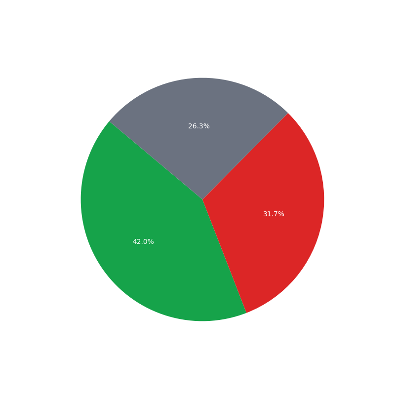
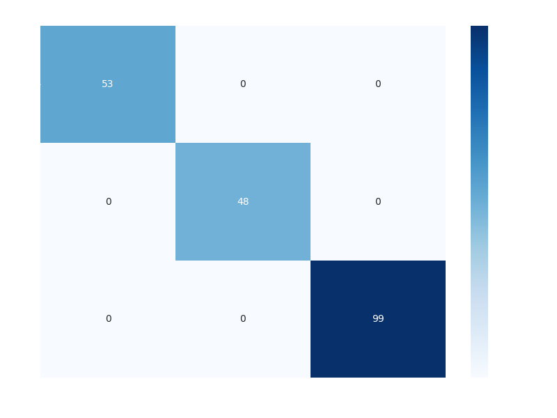

# Social Media Sentiment Analysis Engine

## Project Demo
[](https://youtu.be/1wW4YbmwawY)

> Click the preview image above to watch the full system walkthrough and dashboard demonstration.

## Overview
The Social Media Sentiment Analysis Engine is a professional-grade end-to-end machine learning project designed to analyze and visualize public opinion from social media data. It demonstrates the complete lifecycle of sentiment analytics, from synthetic data generation and NLP preprocessing to model training and high-fidelity interactive dashboard deployment.

## Use Cases
- **Brand Monitoring**: Track how users feel about new product launches or updates.
- **Crisis Management**: Identify spikes in negative sentiment to address issues before they escalate.
- **Customer Insights**: Extract top positive and negative keywords to understand what users value most.

## Visual Insights

### Sentiment Distribution Analysis


### Model Confusion Matrix


### Model Comparison Analysis


### Top Keyword Importance


## Tech Stack
- **Machine Learning**: Scikit-learn (Logistic Regression, Naive Bayes, Random Forest)
- **NLP**: NLTK (Tokenization, Stopword Removal, Regex Cleaning)
- **Visualizations**: Plotly, Matplotlib, Seaborn, WordCloud
- **UI & Dashboard**: Streamlit

## Architecture
```text
Social-Media-Sentiment-Analysis/
├── app/                        # Dashboard application layer
│   └── dashboard.py            # Streamlit interactive UI
├── data/                       # Dataset management
├── models/                     # Serialized ML artifacts
├── outputs/                    # Exported reports and visualizations
├── src/                        # Core processing logic
└── main.py                     # Pipeline orchestration script
```

## How to Run
1. **Install Dependencies**
   ```bash
   pip install -r requirements.txt
   ```
2. **Execute the Data Pipeline**
   ```bash
   python main.py
   ```
3. **Launch the Interactive Dashboard**
   ```bash
   streamlit run app/dashboard.py
   ```

## Outputs
- **Processed Data**: `data/cleaned_data.csv`
- **Static Artifacts**: Available in `outputs/` (Confusion Matrix, Model Comparison, Accuracy Reports).
- **Interactive UI**: A professional dark-themed dashboard accessible locally on port 8501.
